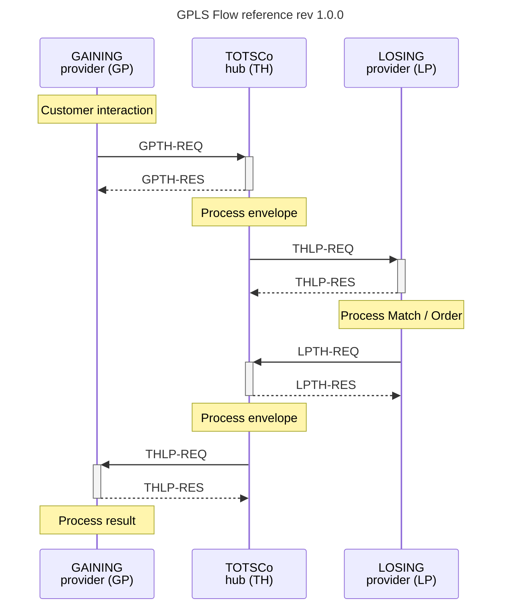

# GPLS Info

## GPLS communication sequence - reference diagram

The intention of this diagram, is to remove confusion when discussing a network contact point, between communication providers and the hub.

For example, if discussing an issue in which a 404 message is being return to the losing provider from the hub in response to sending match results, the 404 would be referenced as `LPTH-RES`. That 404 would be in response to the results sent in `LPTH-REQ`.

### PRs for improvements etc welcomed.

Using [mermaid](https://mermaid.js.org/intro/) diagrams as code.

### Additional resources
[TOTSCo Document Centre](https://totsco.org.uk/documents-centre/)

_This work is licensed under the Creative Commons Attribution 4.0 International License. To view a copy of this license, visit http://creativecommons.org/licenses/by/4.0/ or send a letter to Creative Commons, PO Box 1866, Mountain View, CA 94042, USA._
